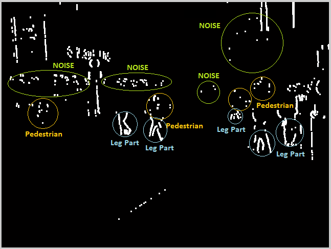

# Efficient Region Proposal for Pedestrian Detection

This project proposes a probability function to estimate the possibility of a person in a specific region to generate detection windows which have high response of person appearance.

This function will be used for ranking the sliding windows which are the input of a human detector.

# Overview

We contribute 2 main points. The first point is: a modified version of a *Digital Image Stabilization* technique called [**Gray-code Bit-plane Matching algorithm**](https://ieeexplore.ieee.org/document/793546) (GC-BPM) is proposed to fastly detect the motion. The motion need to detect here is the background motion which should be removed. The result image after removing the background motion is sparse and contains much rich information. By observing this result image, we realized that the region which has the highest probability of motion of pedestrian is their **legs**. The usefulness of the leg region for pedestrian detection is evaluated in [this paper](https://ieeexplore.ieee.org/document/1336450). [G. Liang and Q. Li](https://ieeexplore.ieee.org/document/7532895) also describe the biology model for pedestrian detection in which the leg region contributes a crucial part. This leg region is used as the motion-based feature. In addition, this technique also solves the problem of shaking camera. However, because of the imperfect motion detection, there are so many noise in the result image. A morphological process therefore is performed to reduce such noises.

The second contribution is: A probability function is proposed to estimate the possibility of pedestrian on a specific detection window. This function is a combination of dynamic and static features which are motion-based and edge-based features. As mentioned before, we use the leg region as the motion-based feature while the edge-based feature is the vertical edges. It is supposed that the vertical edges of pedestrian are more than almost other around objects (see this [book](http://www-brs.ub.ruhr-uni-bochum.de/netahtml/HSS/Diss/WiegersmaAalzenJaap/) and [paper](https://www.researchgate.net/publication/262939616_Fast_Pedestrian_Detection_Based_on_Integral_Edge_Map_and_Part_SVM)). We believe that this assumption could be considerable especially for the moving around objects.

# Camera Ego-motion Removing

Given a camera fixed on a moving vehicle, the camera ego-motion could be considered that it contains 2 types of motion: *scaling motion* and *translation motion*. The *scaling motion* represents the forward and backward movement of the vehicle. The *translation motion* represents the turning left/right movement (in horizontal direction), and the shaking movement (in horizontal and vertical direction). In order to remove the camera ego-motion, we have to calculate and remove the scaling and *translation motion* of the camera.

Assume that the speed capturing of the camera is fast enough to make the *scaling motion* between the 2 sequent frames is small. It means the background pixels do not move very far when the vehicle moves forward or backward. Hence, the *scaling motion* should be ignored. The *translation motion* is still taken into account because the turning left/right movement makes the background remarkably change. For the serious real-time constrained applications, removing the *scaling motion* may significantly reduce the computation.

Given 2 sequent frames, they are named the previous frame and the current frame. Since the background motion now has only *translation motion*, we suppose that the transformation between 2 sequent frames is the *Translation Transformation*. It means every pixel of the previous frame background are correspondingly located on the other position on the current frame. Each pixel on the background therefore moves like their neighbors between 2 sequent frames. The *Motion Vector* now performs on 2 directions which are horizontal and vertical direction.

We translate the previous frame through the *Motion Vector*. Consequently, differencing the current frame and the previous frame after translating will get the *Moving Frame* that only shows the independent motion of the moving objects. The more accurate *Motion Vector* detection is, the less background pixels are treated as moving pixels.

The idea of calculating the background motion is now easier because we just focus on *translation motion* detection. Firstly, some featured points are choosed on the previous frame. Next, we find the corresponding points of them on the current frame. Finally, subtracting their coordinate will get the background motion or the *Motion Vector*.

    
     
    Moving Frame

# The Probability Function

We define a probability function to compute the pedestrian proposal score for any detection window candidate. The probability function is combined by dynamic and static feature. We use the moving pixels as the dynamic feature, and the vertical gradient as the static feature.

## Dynamic Feature

When a person is moving, the body part of him which has the highest probability of moving is his leg. By observing this sign in the *Moving Frame*, we define a Leg Region inside a detection window. The Leg Region makes the pedestrian locate on the center area of a detection window, which leads to high classification response. The score of dynamic feature of a detection window is computed by counting the foreground pixels in the leg region.

## Static Feature

The score of static feature of a detection window is the total number of the foreground pixels of the detection window in the vertical gradient image. Those foreground pixels firstly are locally thresholded by the mean intensity value of the detection window.

## The function

The process of removing background motion is imperfect because of the error on motion detection process and the different distance of the objects in the scene. The pedestrians who are not moving therefore might appear as the noise pixels in the *Moving Frame*. Consequently, the dynamic score of a pedestrian who are not moving is always lower than a moving pedestrian. The static feature is added to balance the score of the moving and not moving pedestrian. The score of a windows which contain pedestrian thus could be not roughly low.

To make the dynamic feature become the main factor, we propose the probability function as follow

> *PROB* = sqrt(*f_dynamic* ^ 2 + *f_static*) / (*m* × *n*)

where *f_dynamic* and *f_static* represent the dynamic and static feature, respectively. *PROB* is the pedestrian proposal score of the detection window. *m* and *n* are the number of row and column of the detection window, respectively. To detect pedestrian in different distances and different sizes, normalization in this step is essential for the fairness between the windows in different sizes.

# Conclusions

Motion-based feature really increases the performance of a pedestrian classifier. Based on motion feature, a simple function is proposed to refine the number of detection windows from thousands to hundreds while remaining the detection rate. A new version based on a low-complexity digital image stabilization technique is utilized to detect the motion. In addtion, we believe that this modified version of this technique could fastly detect the motion without any influence of camera shaking. These findings could be exploited in any situation where motion detections are needed, specially for pedestrian detection.

Besides, the proposed method still has the limitation in search stratery which is based on sliding window approach. In the future work, a wiser search approach based on motion feature should be used to extract detection windows directly from the *Moving Frame*.

# Result

    
     
    Testing the <a href="https://youtu.be/TlMLEJ-DORU" target="_blank"><i>LOEWENPLATZ video sequence</i></a>

